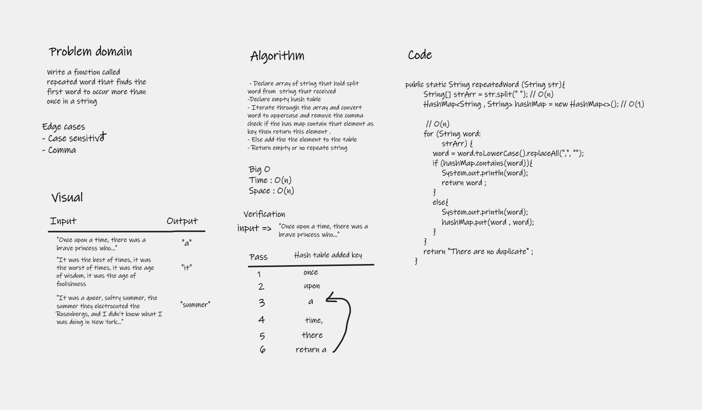
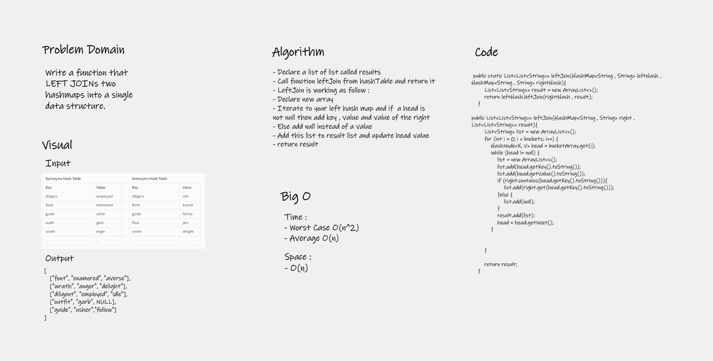

# Hashtables
Hashtables are a data structure that utilize key value pairs , The basic idea of a hashtable is the ability to store the key into this data structure, and quickly retrieve the value.

## Challenge
Build HashTable class from scratch with alot of functionality method 

## Approach & Efficiency
The approach that I made is depends on hashing and retrieve an integer from hashing fitting the size of bucket array and assert this value at the index value , If any collision happen I solved it using chaining using linked list . 

### Put 
- Time Complexity Big O(1) ; 
- Space Complexity Big O(n) ; 

### Get
- Time Complexity :
- Worst case Big O(n) ;
- Average case Big O(1)

### Contains 
- Time Complexity : 
- Worst case Big O(n) ;
- Average case Big O(1)

### Keys
- Time Complexity Big O(1) ;
- Space Complexity Big O(n) ;

### Hash 
- Time Complexity Big O(1) ;
- Space Complexity Big O(1) ;

## API
The Api methods that implemented in the class are : 

### Put
- Arguments: key, value
- Returns: nothing
- This method should hash the key, and set the key and value pair in the table, handling collisions as needed.
Should a given key already exist, replace its value from the value argument given to this method.

### Get
- Arguments: key
- Returns: Value associated with that key in the table

### Contains
- Arguments: key
- Returns: Boolean, indicating if the key exists in the table already.

### Keys
- Returns: Collection of keys

### Hash
- Arguments: key
- Returns: Index in the collection for that key

## Repeated word 
# Challenge Summary
Write a function called repeated word that finds the first word to occur more than once in a string

## Whiteboard Process

## Approach & Efficiency
Big O
Time : O(n)
Space : O(n)

## Solution
You can go to the main app java file and class function `repeatedWord` ;

# Hashmap LEFT JOIN
LEFT JOIN means all the values in the first hashmap are returned, and if values exist in the “right” hashmap, they are appended to the result row.
If no values exist in the right hashmap, then some flavor of NULL should be appended to the result row.

## Challenge
Write a function that LEFT JOINs two hashmaps into a single data structure.

## Approach & Efficiency
Iterate through left hashmap key and check if the key exist in the right hashmap then add its value at the end else add null 

## Solution

