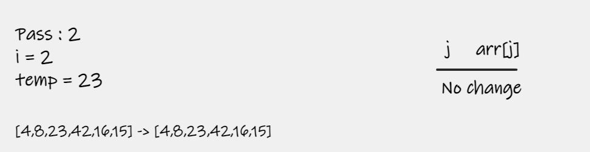

# Insertion Sort
Insertion Sort is a sorting algorithm that traverses the array multiple times as it slowly builds out the sorting sequence. The traversal keeps check of the minimum value and places it in the front of the array which should be incrementally sorted.

## Pseudocode

    InsertionSort(int[] arr)

    FOR i = 1 to arr.length

      int j <-- i - 1
      int temp <-- arr[i]

      WHILE j >= 0 AND temp < arr[j]
        arr[j + 1] <-- arr[j]
        j <-- j - 1

      arr[j + 1] <-- temp

## Pass 1 

In the first pass through of the insertion sort, we check if the next number is a smaller number in the array than what is currently present in index j = 0. We find this smaller number right away in index 1. The `temp` value hold the index = 1 value. At the end of the evaluation, the smaller number will be swapped with the current value in index i. This results in our smallest number of our array being placed first.

## Pass 2

The second pass through the array evaluates the next values at index j = 1 to see if there is a smaller value other than the current position of i. 8 is smaller than 23 . No change at all during the iteration of this pass.

## Pass 3

The third pass through the array evaluates the next values at index j = 2 to see if there is a smaller value other than the current position of i. 23 is smaller than 42 . No change at all during the iteration of this pass.

## Pass 4

The fourth pass through the array evaluates the next values at index j = 3 to see if there is a smaller value other than the current position of i. 16 is smaller than 42 . the value will be updated each time until `temp > arr[j]` then assign `arr[j + 1] = temp`.

## Pass 5

The fourth pass through the array evaluates the next values at index j = 4 to see if there is a smaller value other than the current position of i. 15 is smaller than 42 . the value will be updated each time until `temp > arr[j]` then assign `arr[j + 1] = temp`.

## Efficency

### Time: O(n^2)
The basic operation of this algorithm is comparison. This will happen n * (n-2) number of times…concluding the algorithm to be n squared.
### Space: O(1)
No additional space is being created. This array is being sorted in place…keeping the space at constant O(1).

