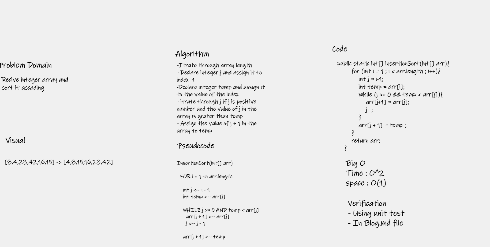

# Challenge Summary
Create sort insertion function that accept array of integer and sort the value and return the sorted array 

## Whiteboard Process

## Approach & Efficiency
Using nested loop to check the value one by one and resorted the value each time 

## Solution
You can go to `App.java` to see the code
