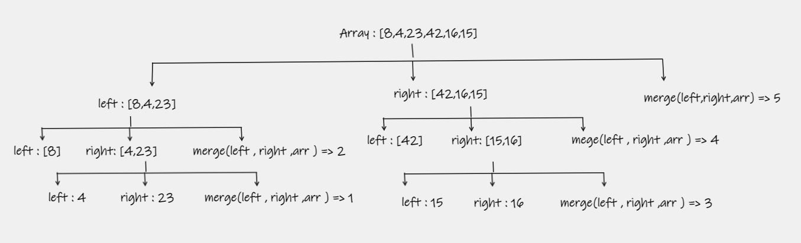
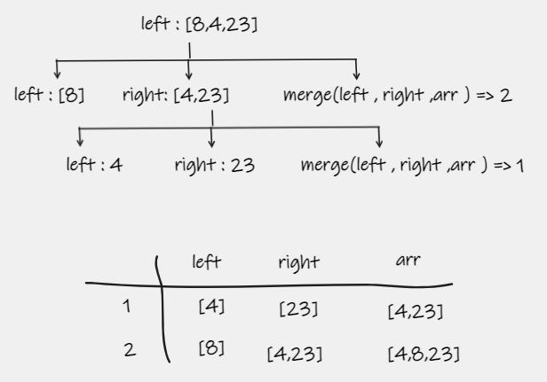
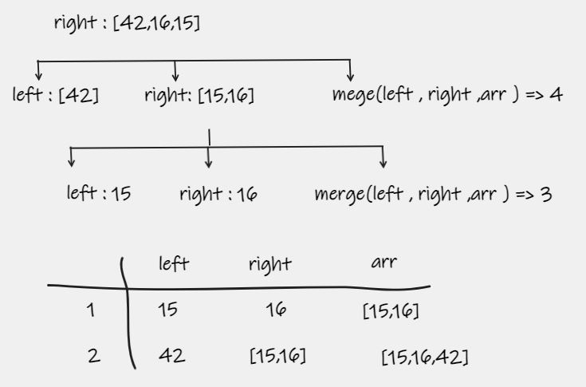
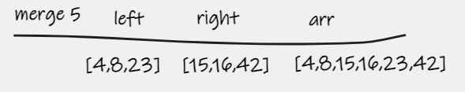

# Merge Sort
Merge Sort is a sorting algorithm that use recursion to divide the array y multiple times as it slowly merge out the sorting sequence. The last function `Merge` keeps check of the minimum value and places it in the front of the array which should be incrementally sorted.

## Pseudocode

    ALGORITHM Mergesort(arr)
    DECLARE n <-- arr.length

    if n > 1
      DECLARE mid <-- n/2
      DECLARE left <-- arr[0...mid]
      DECLARE right <-- arr[mid...n]
      // sort the left side
      Mergesort(left)
      // sort the right side
      Mergesort(right)
      // merge the sorted left and right sides together
      Merge(left, right, arr)

    ALGORITHM Merge(left, right, arr)
    DECLARE i <-- 0
    DECLARE j <-- 0
    DECLARE k <-- 0

    while i < left.length && j < right.length
        if left[i] <= right[j]
            arr[k] <-- left[i]
            i <-- i + 1
        else
            arr[k] <-- right[j]
            j <-- j + 1

        k <-- k + 1

    if i = left.length
       set remaining entries in arr to remaining values in right
    else
       set remaining entries in arr to remaining values in left

## Code will go as follow 

The code using recursion will divide the array half in each time `left` and `right` side until length of the array is less than 1 `(n < 1 )` the step will start to go back and the merge will start . 
## Left Side

The code will start from the left side because the first recursion is `left` the code will divide the left half to another half until `(n < 1 )` the merge will start and merge between (4,23) the smallest value will be at the begging then it will do merge number 2 and 3 and keep sorting . 

## Left Side

The code will now start from the right after we're finishing the left side because the second recursion is `right` the code will divide the right half to another half until `(n < 1 )` the merge will start and merge between (15,16) the smallest value will be at the begging then it will do merge number 2 and 3 and keep sorting .

## Last Merge

The last merge will be between [4,8,23] and [15,16,42] the code will match between each element and sorting it in the right way . 

## Efficency

### Time: O(n^2)
The basic operation of this algorithm is recursion. This will happen `n * log n` number of times….
### Space: O(1)
This array is being sorted in place… the space `O(n)`.

