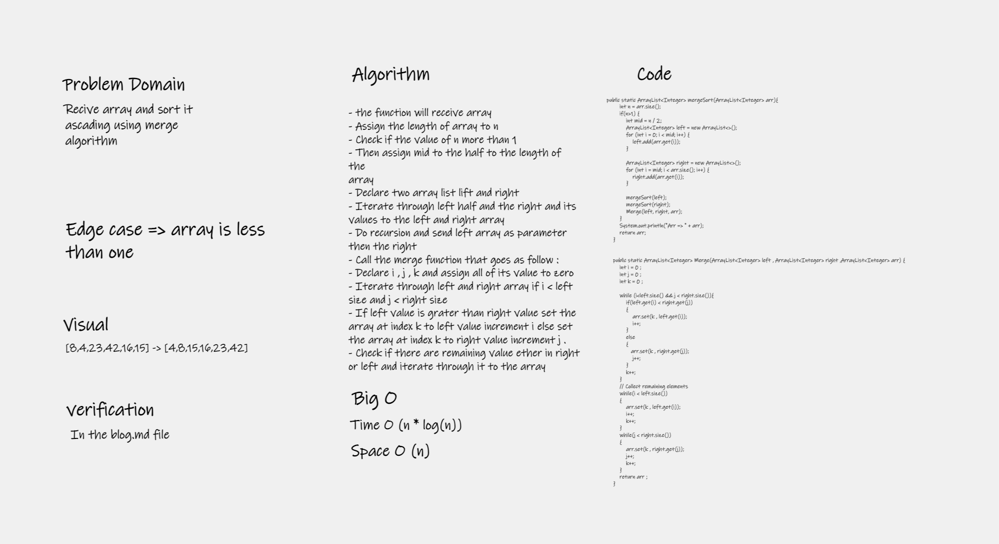

# Challenge Summary
Merge Sort is a sorting algorithm that use recursion to divide the array multiple times as it slowly merge out the sorting sequence. The last function `Merge` keeps check of the minimum value and places it in the front of the array which should be incrementally sorted.

## Whiteboard Process

## Approach & Efficiency
### Time: O(n * log(n))
The basic operation of this algorithm is recursion. This will happen `n * log n` number of times….
### Space: O(n)
This array is being sorted in place… the space `O(n)`.

## Solution
You can go to the app and run the code 