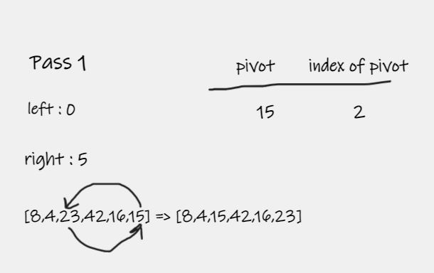
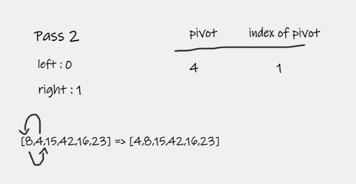
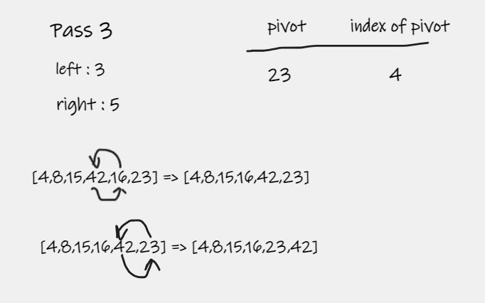

# Quick Sort
Quick Sort is a sorting algorithm that picks an element as pivot and partitions the given array around the picked pivot and slowly builds out the sorting sequence .

## Pseudocode

    ALGORITHM QuickSort(arr, left, right)
    if left < right
    // Partition the array by setting the position of the pivot value
    DEFINE position <-- Partition(arr, left, right)
    // Sort the left
    QuickSort(arr, left, position - 1)
    // Sort the right
    QuickSort(arr, position + 1, right)
    
    ALGORITHM Partition(arr, left, right)
    // set a pivot value as a point of reference
    DEFINE pivot <-- arr[right]
    // create a variable to track the largest index of numbers lower than the defined pivot
    DEFINE low <-- left - 1
    for i <- left to right do
    if arr[i] <= pivot
    low++
    Swap(arr, i, low)
    
         // place the value of the pivot location in the middle.
         // all numbers smaller than the pivot are on the left, larger on the right.
         Swap(arr, right, low + 1)
        // return the pivot index point
         return low + 1
    
    ALGORITHM Swap(arr, i, low)
    DEFINE temp;
    temp <-- arr[i]
    arr[i] <-- arr[low]
    arr[low] <-- temp

## Pass 1

In the first pass through of the insertion sort, we keep tracking pivot and check the element in the array from start to end and compare it with pivot if the number at index `i` is a smaller than pivot we swap element with the elemnt at index `low` than we will swap pivot with greater value lower than pivot `for example [1,2,10,8,4] and pivot is 7 the greater value smaller than pivot is 4`   .

## Pass 2

The second pass through the array starting with the left half and do the same process as first pass .  

## Pass 3

The third pass through the array starting with the right half and do the same process as first pass .

## Efficency

### Time: O(n * log(n))
The basic operation of this algorithm is comparison. This will happen n * log (n) number of times….
### Space: O(1)
No additional space is being created. This array is being sorted in place…keeping the space at constant O(1).

