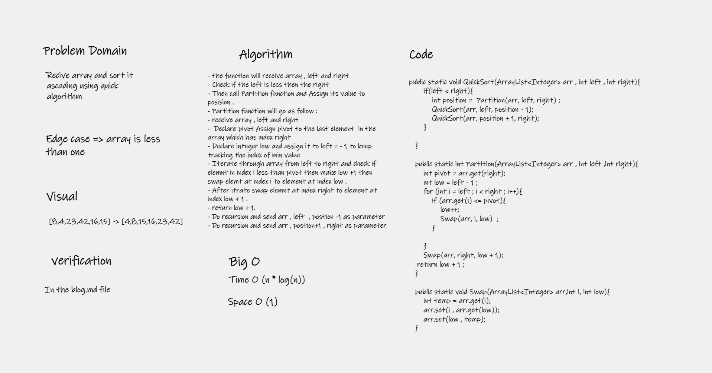

# Challenge Summary
Quick Sort is a sorting algorithm that picks an element as pivot and partitions the given array around the picked pivot and slowly builds out the sorting sequence .

## Whiteboard Process

## Efficency

### Time: O(n * log(n))
The basic operation of this algorithm is comparison. This will happen n * log (n) number of times….
### Space: O(1)
No additional space is being created. This array is being sorted in place…keeping the space at constant O(1).

## Solution
You Can Run The Code From App.java main function 
