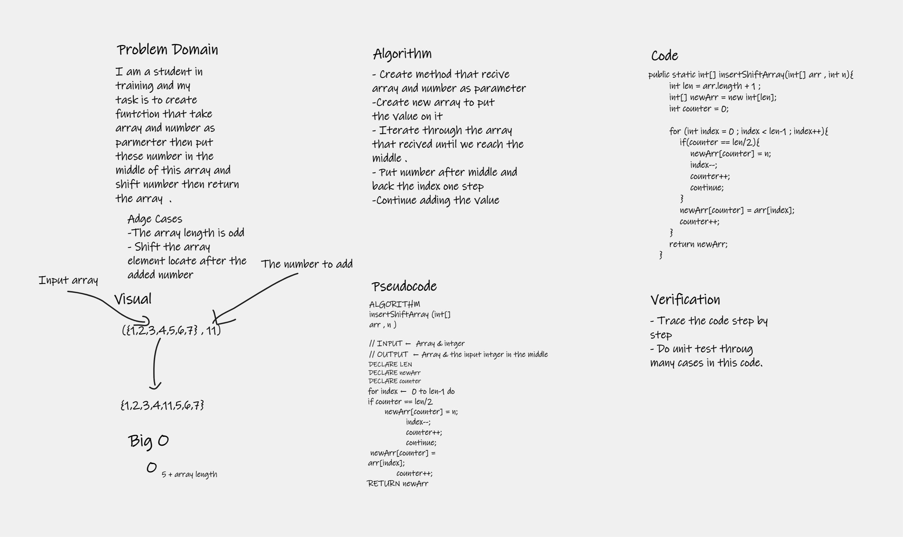

# Insert to Middle of an Array

a function called `insertShiftArray` which takes in an array and a value to be added then it will return an array with the new value added at the middle index.

    [2,4,6,-8], 5	        =>  [2,4,5,6,-8]
    [42,8,15,23,42], 16	    =>  [42,8,15,16,23,42]

## Whiteboard Process

#### Approach & Efficiency

Iterate throgh array until we reach the middle then add the number from anther counter . 

Big O => 5 + size of array . 