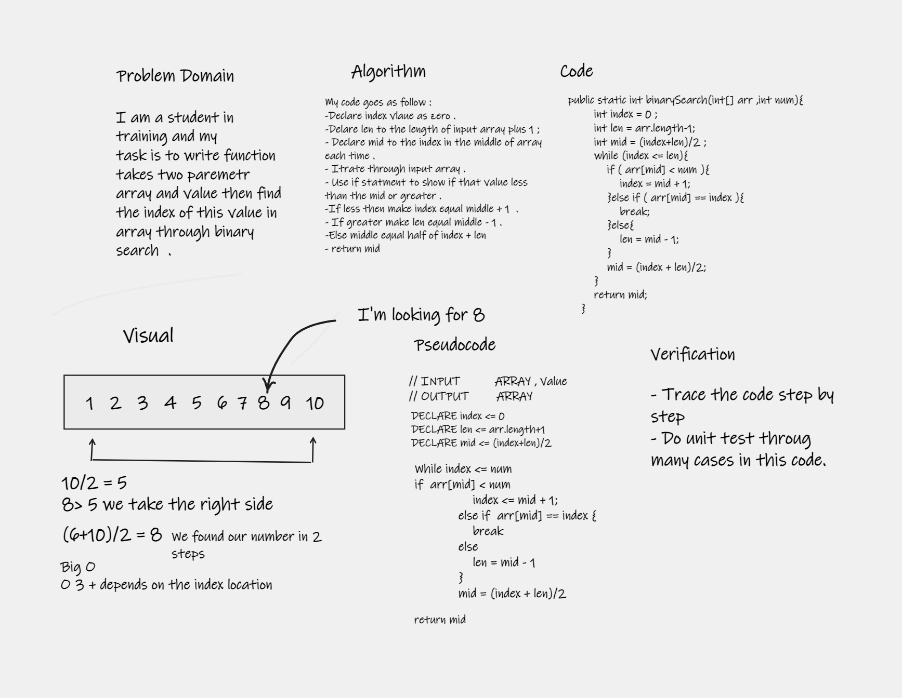

# Binary search 
a function called binary Search which takes an array and value as an argument. return the index of the value in the array using binary search algorithm .

    [4, 8, 15, 16, 23, 42], 15 => 2

## Whiteboard Process

## Approach & Efficiency
My approach is to used binary search algorithm which divide the hole number in the half then detct where the value in any side then keep doing that until we find the number we looking for .

The Big O indicater for the complixity in the code and the number of operation that takes and for this approach 3 + depends on location of value.  