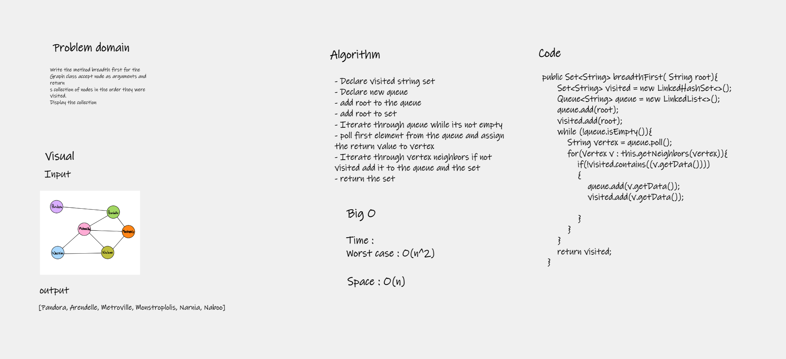
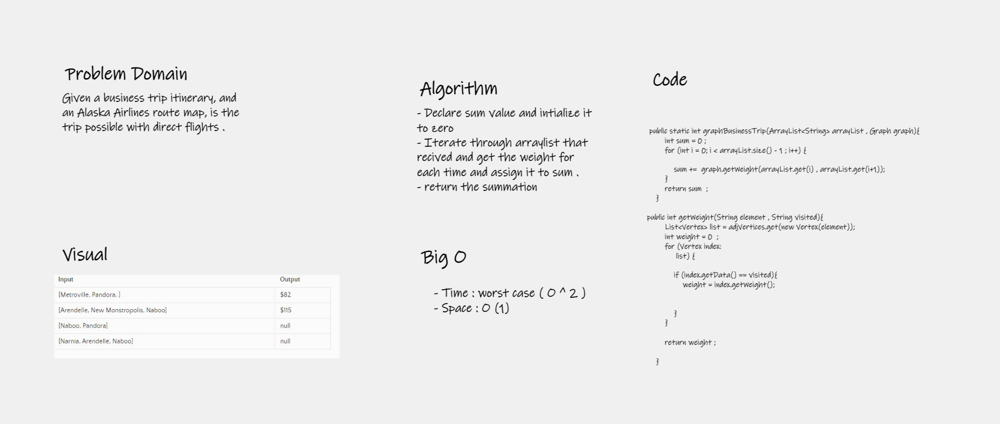
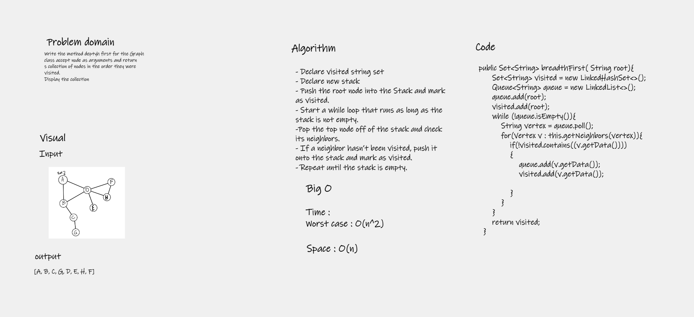

# Graphs
A graph is a non-linear data structure that can be looked at as a collection of vertices (or nodes) potentially connected by line segments named edges

## Challenge
Implement your own Graph. The graph should be represented as an adjacency list, and should include the following methods:

- add node
- add edge
- get nodes
- get neighbors
- size

## Approach & Efficiency
Using hashmap tp store vertex as key and the edges as array list 

Time : 
- Big O (n)

Space : 
- O(n + 2e) // e is number of edge 

## API

- add node  // Add new vertex 
- add edge // Add new edges 
- get nodes // get all nodes
- get neighbors // get all neighbors of specific node
- size  // get the size of all graph node

# breadth-first
Write the method breadth first for the Graph class accept node as arguments and returns collection of nodes in the order they were visited. Display the collection
## Whiteboard Process

## Approach & Efficiency
The approach that I used is using queue to put element and poll it depend on if it contains in set or not

## Solution
Go to app file, and you can run the method from class graph

# Graph-business-trip
Given a business trip itinerary, and an Alaska Airlines route map, is the trip possible with direct flights? If so, how much will the total trip cost be?

## Whiteboard Process

## Approach & Efficiency
Iterate through the arraylist that received and find the weight of all neighbour and add them to summation 

## Solution
You can run the app from App.java file 

# Depth First Traversal

## Challenge
Conduct a depth first preorder traversal on a graph

## Approach & Efficiency
Using stack and Push the root node into the Stack and mark as visited and keep tracking then pop the element that visited from stack .

## Solution

