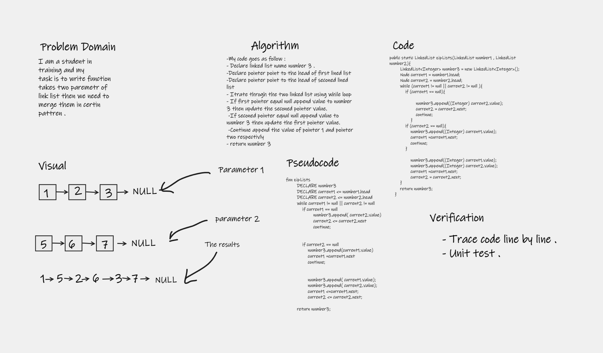

# Singly Linked List
## Whiteboard Process

## Challenge Summary
Linked list we can decribe it like  List is a sequence of `Nodes`
each Node references the next Node in the link. Its how to structure your data .  My challange about create linked list that you can insert value to it then you can check for any value in the list if it included 
the last things that you can render all value you created it 

## Approach & Efficiency
The approach that I used is about next pointer that check the next node so we can use `While` loop to check the next value if its not null we can do action .

## Whiteboard Process
## Append

## Insert before

## Insert after

## Challenge Summary
Get the value of a given index using tail instead of head 

## Approach & Efficiency
The approach that I used is about tail then create pointer that check the previous node, so we can use `While` loop to check  previse value if it's not null we can do action .

## Whiteboard Process

## Challenge Summary
Create method that merge to link list in certain pattern .

## Approach & Efficiency
The approach that I used is created two pointer iterate through both in link list then  that check , so we can use `While` loop to check  and do action .

## API
### insert 
The insert method give you the ability to insert value in Listlink.
### include 
The include method give the ability to check value if it exists in your Listlink.
## Append 
This method add node at the end of the list before null . 
## Insert before 
This method accept two parameter one is index that we are looking then we add node before it .
## Insert after
This method accept two parameter one is index that we are looking then we add node after it .
## kthFromEnd 
This method accept index that we are looking for its value using tail then we return this value.
## zipList 
This method accept two parameter then merge them in certain pattern.
### toString 
The toString method give the ability to retrieve the values in your Listlink in organize way.

