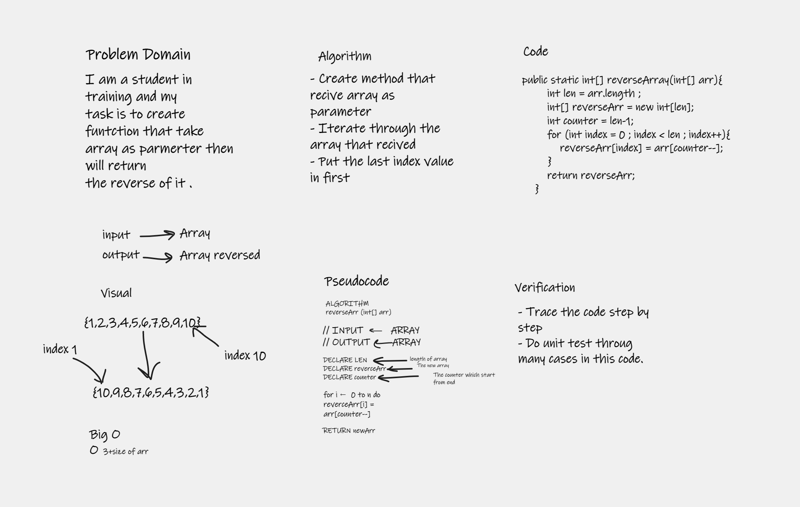

# Reverse an Array
a function called reverseArray which takes an array as an argument. return an array with elements in reversed order.

    [1, 2, 3, 4, 5, 6]	 = > [6, 5, 4, 3, 2, 1]

## Whiteboard Process

## Approach & Efficiency
My approach is to itrate throug the array and put the last index in the first . 

The Big indicater for the complixity in the code and the number of operation that takes and for this approach 3+size of array.  