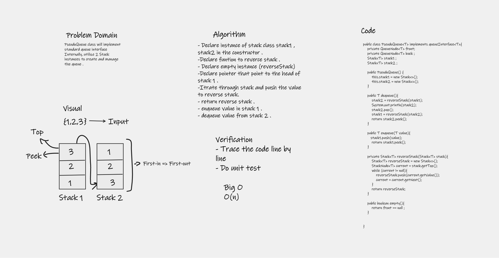
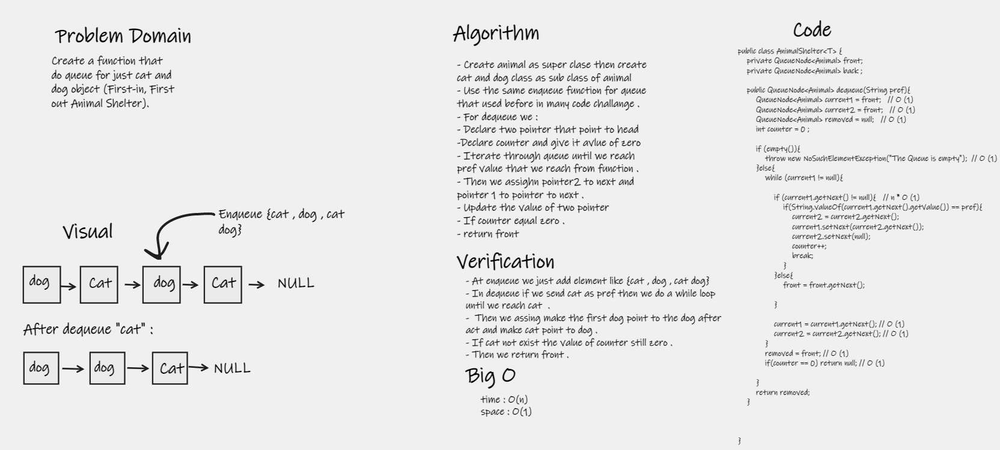
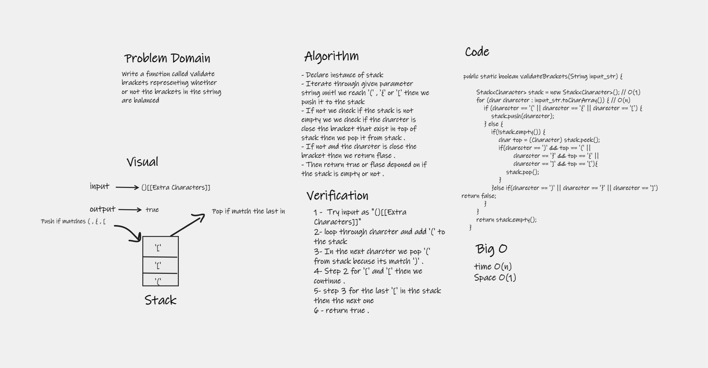
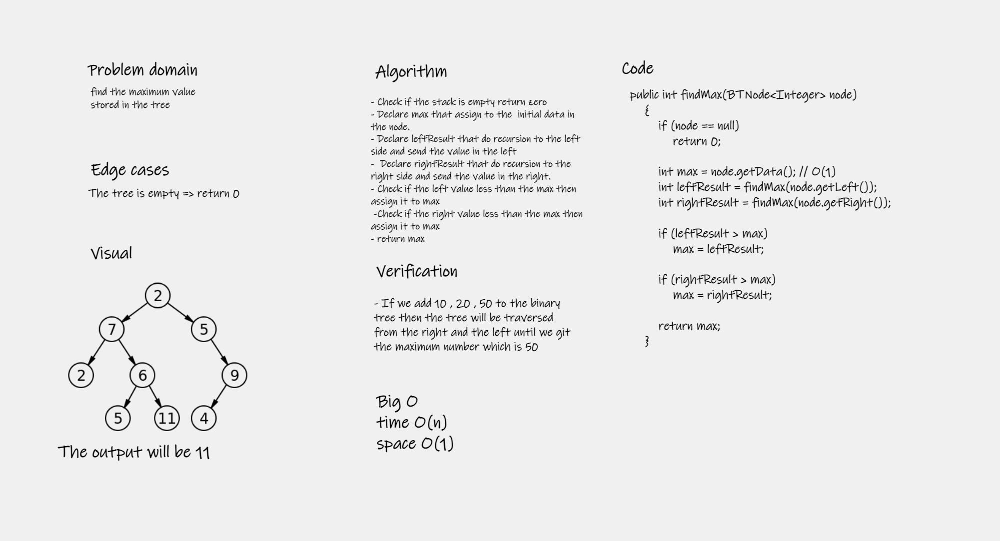
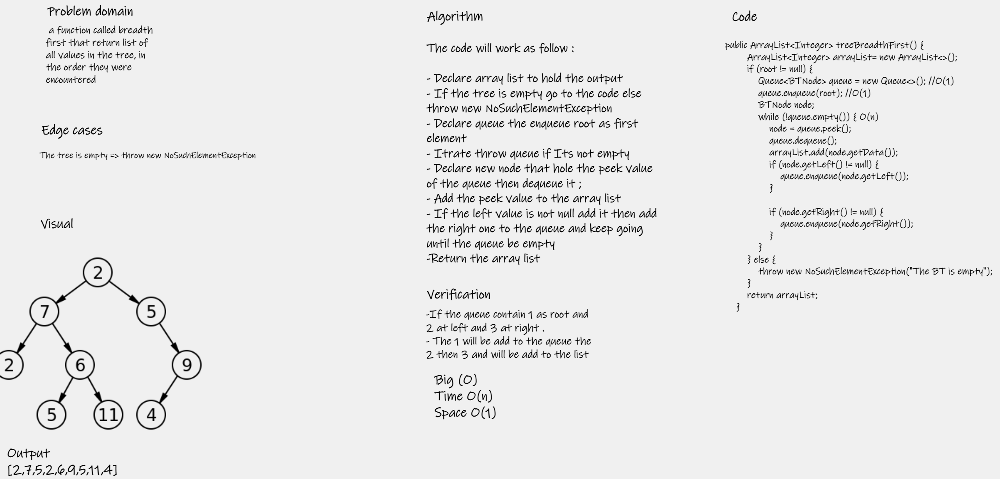

# Stacks and Queues
- Stack is a container of objects that are inserted and removed according to the last-in first-out (LIFO) principle.
- Queue is a container of objects (a linear collection) that are inserted and removed according to the first-in first-out (FIFO) principle.

## Challenge
Make Stack and Queue class from scratch the make methods that make a user can manipulate with data . 

## Approach & Efficiency
- My approach in stack is to make a top pointer thats point to the last element then I can change the data from top . 
- My approach in queue is to make first and last pointer then we can manipulate with data . 

## API
### Stack 
- Push 

    A method let a user insert any value to the stack 
- Pop

  A method let a user delete the first value in the stack . 

- Peek

    A method that let the user know what the first value in the stack .

- empty 
    Check if the stack is empty 

### Queue
- enqueue

  A method let a user insert any value to the Queue
- dequeue

  A method let a user delete the first value in the Queue .

- Peek

  A method that let the user know what the first value in the Queue .

- empty

  Check if the stack is empty 

## Code Challenge 11 

### Challenge Summary
Build queue using two stack 

#### Whiteboard Process

#### Approach & Efficiency
Reverse stack one in stack two then we can use Stack class to manipulate Queue . 

#### Solution
Put this code in App java file  

    PseudoQueue<Integer> queue  = new PseudoQueue<>();
    queue.enqueue(1);
    queue.enqueue(2);
    System.out.println(queue.enqueue(3));
    System.out.println(queue.dequeue());

## Code Challenge 12 
# Challenge Summary
Create a function that do queue for just cat and dog object (First-in, First out Animal Shelter).

## Whiteboard Process

## Approach & Efficiency
Make two pointer then remove the value by make previous node points to the next .

## Solution
Put this code in App java file to run the code and see how its work : 

        Animal cat = new Cat("cat");
        Animal dog = new Dog("dog");
        AnimalShelter animalShelter = new AnimalShelter();
        System.out.println(animalShelter.enqueue(cat));
        System.out.println( animalShelter.enqueue(dog));
        System.out.println( animalShelter.enqueue(dog));
        System.out.println( animalShelter.enqueue(dog));
        System.out.println( animalShelter.enqueue(dog));
        System.out.println(animalShelter.dequeue("cat"));
        System.out.println(animalShelter);

## Code Challenge 13
# Challenge Summary
a function called validate brackets that check if a string have brackets in valid way .

## Whiteboard Process

## Approach & Efficiency
Using stack as last-in first-out to do the matching between open bracket and close bracket 

## Solution
You can invoke the function from main using : 

    System.out.println(validateBrackets("[}"));

## Code Challange 15
## Trees
The tree one of the method of data structure that improve efficiency of our code , In my code I covered Binary Trees, Binary Search Trees

### Challenge
Node
Create a Node class that has properties for the value stored in the node, the left child node, and the right child node.

#### Binary Tree
Create a Binary Tree class
Define a method for each of the depth first traversals:
- pre order
- in order
- post order which returns an array of the values, ordered appropriately.

### Binary Search Tree
Create a Binary Search Tree class
This class should be a sub-class (or your languages equivalent) of the Binary Tree Class, with the following additional methods:
- Add
- Contains

### Approach & Efficiency

- In binary search tree the search is Big O `log(n)` which is more efficient than the first one which is `O(n)`

### API
#### Binary Tree
- traverse
To traverse the tree by given the order you won't (pre-order , in-order , post-order )
- levelOrderTraversalLoop
Traverse in the tree and print out a value depend on the level and from left to right .  

### Binary Search Tree
- Add
This method used to add value to search tree
- Contains
This method accept a value then return boolean depend on if its exist or not .  

## Challenge 16 Max of binary tree
We will find the maximum value stored in the tree. we can assume that the values stored in the Binary Tree will be numeric.

## Whiteboard Process

## Approach & Efficiency
The approach I used it's mainly used the recursion to traverse each element and compare it with the maximum number .

## Solution

        BinaryTree<Integer> binaryTree1 = new BinaryTree<>();
        binaryTree1.setRoot(new BTNode<Integer>(1));
        // level 1
        binaryTree1.getRoot().setLeft(new BTNode<Integer>(2));
        binaryTree1.getRoot().setRight(new BTNode<Integer>(800));

        // level 2
        binaryTree1.getRoot().getLeft().setLeft(new BTNode<Integer>(350));
        binaryTree1.getRoot().getRight().setLeft(new BTNode<Integer>(600));
        System.out.println(binaryTree1.findMax(binaryTree1.getRoot()));;

## Challenge 17 
a function called breadth first that return list of all values in the tree, in the order they were encountered

## Whiteboard Process

## Approach & Efficiency
My approach is to add the element in the tree to the queue by position the first is root then the left then the right then we can extract them from the queue & the efficiency is increase by doing it using queue
## Solution
          BinaryTree<String> binaryTree = new BinaryTree<>();
          binaryTree.setRoot(new BTNode<>(5));
          // level 1
          binaryTree.getRoot().setLeft(new BTNode<Integer>(1));
          binaryTree.getRoot().setRight(new BTNode<Integer>(15));
  
          // level 2
          binaryTree.getRoot().getLeft().setLeft(new BTNode<Integer>(15));
          binaryTree.getRoot().getRight().setLeft(new BTNode<Integer>(20));
          System.out.println(binaryTree.treeBreadthFirst());
