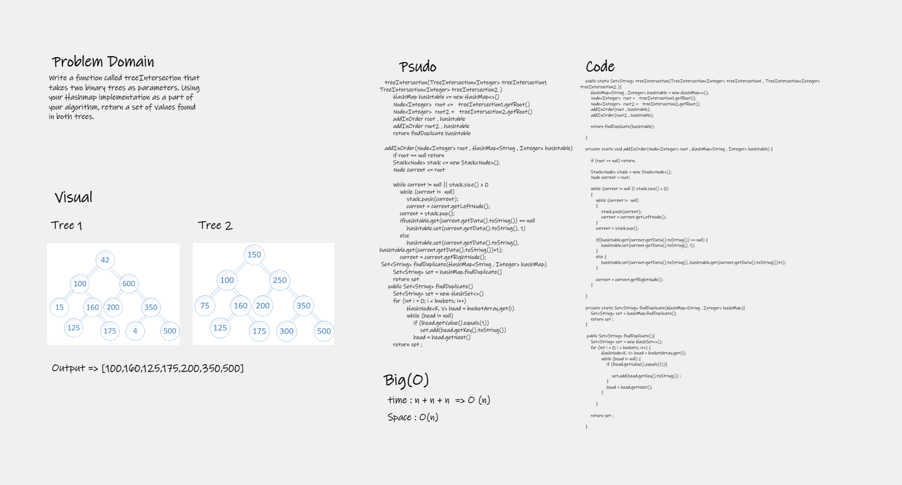

# Challenge Summary
<!-- Description of the challenge -->

## Whiteboard Process

## Approach & Efficiency
Add 1 to the value of element that been repeated more than one time , the return a set of the key that have value more than one .  

## Solution
You can run the solution from `App.java`
